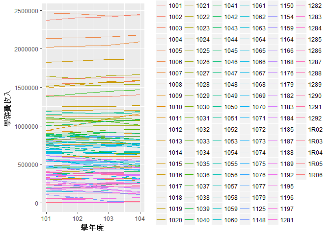

長庚大學與私立大專校院學校收支比較
================

-   期末專題分析規劃與假設 (`10pt`)

劉芷辰分析議題背景
------------------

首先，想要了解長庚大學的收支情況， 不僅僅要跟校內歷年的比較， 也必須跟其他學校比較， 才能多方面了解學費漲價是否合理。

所以在蒐集資料時， 我們必須得到各年度、各私立大專院校的收支資料， 且當中收支的分類項目/定義必須是相同。

分析動機
--------

近期學校常常在討論到底要不要漲價? 也常常聽到學生在抱怨學校都不給經費?......等問題， 所以我就決定來用這次機會來檢視我們學校的收支狀況， 並且和其他私立大專院校來做比較， 看看學校是否如學生所說的一樣"勤勞樸實"。

使用資料
--------

我從政府資料開放平台下載這些資料: 私立大專校院學校各項收入情形、 私立大專校院學校各項經常支出情形、 私立大專校院學校各項資本支出情形。

我都鎖定在"私立大專校院學校"， 並且這些資料的時間都相同(101~104學年度)， 這樣才能夠合併並且互相比較

載入使用資料們

``` r
library(readxl)
Finance_RPT_02_2_2 <- read_excel("C:/Users/JHIH-CHEN/Downloads/university/Finance_RPT_02_2_2.xlsx")
View(Finance_RPT_02_2_2)

Finance_RPT_02_2_3 <- read_excel("C:/Users/JHIH-CHEN/Downloads/university/Finance_RPT_02_2_3.xlsx")
View(Finance_RPT_02_2_3)

Finance_RPT_02_2_4 <- read_excel("C:/Users/JHIH-CHEN/Downloads/university/Finance_RPT_02_2_4.xlsx")
View(Finance_RPT_02_2_4)
```

資料處理與清洗
--------------

將所需要用到的資料， 合併成一個， 方便之後做各類/統整/交叉分析。

處理資料

``` r
library(dplyr)
```

    ## 
    ## Attaching package: 'dplyr'

    ## The following objects are masked from 'package:stats':
    ## 
    ##     filter, lag

    ## The following objects are masked from 'package:base':
    ## 
    ##     intersect, setdiff, setequal, union

``` r
Finance<-data.frame(
  inner_join(Finance_RPT_02_2_2,Finance_RPT_02_2_3,Finance_RPT_02_2_4,by=c("學年度","學校代碼","學校名稱"))
  )
library(reshape2)
Finance1<-Finance_RPT_02_2_2[1:4]
Finance1$學雜費收入<-as.numeric(Finance1$學雜費收入)
```

    ## Warning: 強制變更過程中產生了 NA

探索式資料分析
--------------

目前生出了四個圖

``` r
#------------1.各學校101~104學年度學雜費收入折線圖(觀察各學校學雜費趨勢)------------
#install.packages("ggplot2")
library(ggplot2) 
ggplot(Finance1, 
       aes(x = 學年度, 
           y = 學雜費收入,
           color=學校代碼)) + 
    geom_line()
```

    ## Warning: Removed 1 rows containing missing values (geom_path).



``` r
#------------2.各學校101~104學年度學雜費收入散部圖(觀察各學校學雜費差異)------------
ggplot(Finance1, 
       aes(x = 學校代碼, 
           y = 學雜費收入,)) + 
    geom_point()+facet_grid(學年度~.)+
    geom_smooth(method='lm')#因為各校學雜費收入過於分散，所以畫不出趨勢線
```

    ## Warning: Removed 3 rows containing non-finite values (stat_smooth).

    ## Warning: Removed 3 rows containing missing values (geom_point).


``` r
#------------3.長庚大學101~104學年度學雜費收入表(長庚大學校內學雜費歷年比較)----------------
#cgu<-data.frame(Finance[grepl("長庚大學",Finance$學校名稱),])
cgu1<-data.frame(Finance1[grepl("長庚大學",Finance1$學校名稱),])#篩選出長庚大學的資料
library(reshape2)
cgu1.1<-dcast(cgu1,學校代碼+學校名稱~學年度)#轉成寬表
```

    ## Using 學雜費收入 as value column: use value.var to override.

``` r
#cgu1.2<-melt(cgu1.1,id.vars = c("學校代碼","學校名稱"))
knitr::kable(cgu1.1)
```

| 學校代碼 | 學校名稱 |     101|     102|     103|     104|
|:---------|:---------|-------:|-------:|-------:|-------:|
| 1009     | 長庚大學 |  611355|  605745|  605588|  605140|

``` r
#------------4.104學年度學雜費收入Heatmap(觀察各大學104學年度學雜費)----------------
library(ggplot2)
Finance104<-data.frame(Finance1[grepl("104",Finance1$學年度),])
ggplot(Finance104, aes(學雜費收入,學校名稱)) + 
    geom_tile(aes(fill = 學雜費收入),
              colour = "white")+ 
    scale_fill_gradient(
        low = "white",high = "steelblue") 
```

    ## Warning: Removed 3 rows containing missing values (geom_tile).


期末專題分析規劃
----------------

1-1校內各學年度學雜費比較 1-2與其他學校學雜費交叉比較 1-3查詢各校學生人數

--&gt;假設學校學費比其他學校便宜

2-1校內支出主要項目 2-2與其他學校支出主要項目交叉比較

--&gt;假設學校支出跟其他學校

3-1校內收入來源 3-2與其他學校收入來源交叉比較

--&gt;假設學校很會投資，收入比別人高
